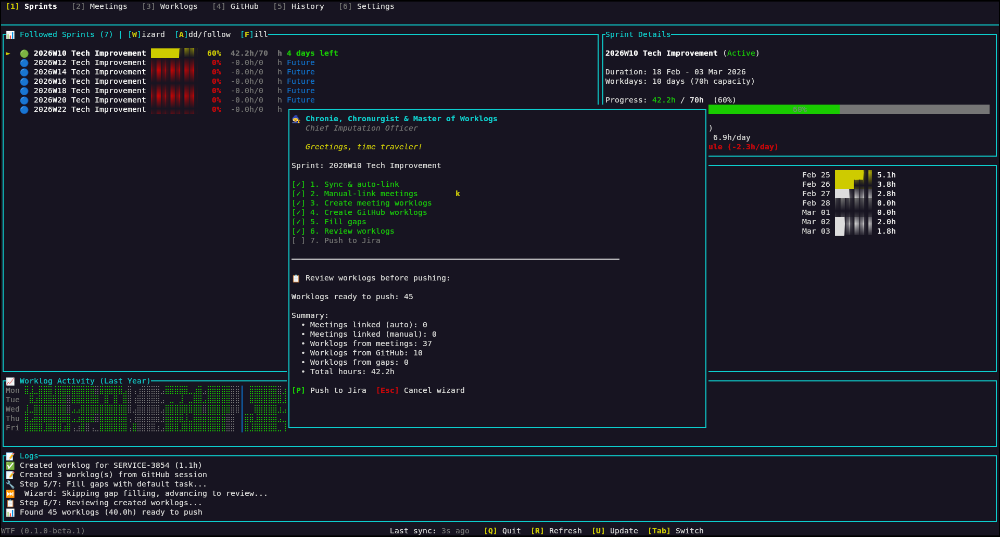

# 🧙 WTF - Worklog Time Filler

A powerful TUI (Terminal User Interface) for managing Jira worklogs, integrating meetings, and tracking time with magical ease.

> ⚠️ **BETA SOFTWARE**: WTF is currently in beta (v0.1.x). It's feature-complete and functional, but expect some rough edges. Always review worklogs carefully before pushing to Jira!



## ✨ Features

- **Automated Imputation Workflow** - Guided workflow that syncs, links, fills gaps, and pushes worklogs automatically
- **Sprint Tracking** - Visual progress indicators, real-time statistics, and activity charts
- **Meeting Integration** - Sync Google Calendar and auto-link meetings to Jira issues
- **Worklog Management** - Stage, review, and push worklogs with batch operations and history tracking
- **GitHub Integration** - Track coding sessions and create worklogs from GitHub activity (filtered by organisation)
- **In-app Settings** - Edit your configuration directly from the TUI (no need to edit TOML files)

## 🚀 Installation

### Prerequisites
- **Rust** - [Install Rust](https://www.rust-lang.org/tools/install) (1.70 or later)
- **Jira account** with API access
- **Google Calendar** API credentials (optional, for meeting sync)
- **GitHub CLI (`gh`)** (optional, for GitHub integration) - [Install gh](https://cli.github.com/)

### Quick Install

> ⚠️ **Beta Software**: WTF is currently in beta (v0.1.x). Expect some rough edges and report issues!

**Option 1: Install directly from GitHub (easiest)**

```bash
cargo install --git https://github.com/thermoweb/work-time-filler.git --locked wtf-cli
```

This clones the repo, builds, and installs the `wtf` command in one step!

**Option 2: Clone and install**

```bash
# Clone the repository
git clone https://github.com/thermoweb/work-time-filler.git
cd work-time-filler

# Build and install (adds 'wtf' command to your PATH)
cargo install --path wtf-cli --locked
```

**To update to the latest version:**
```bash
cargo install --git https://github.com/thermoweb/work-time-filler.git --locked wtf-cli --force
```

The `wtf` command is now available globally! 🎉

**Note:** Always use `--locked` to respect dependency versions.

## 🎬 Getting Started

### 1. Initial Setup

**No config file yet?** If you run `wtf tui` without a config, it will automatically launch the setup wizard for you.

The wizard walks you through these steps:
1. Jira credentials (URL, email, API token) — connection is tested at step 4
2. Selecting which Jira boards to track (fetches from Jira and lets you pick)
3. Fetching sprints for those boards
4. Following sprints you want to work on
5. GitHub integration — optional, asks for an organisation filter
6. Google Calendar OAuth setup — optional, browser-based

You can run the interactive setup wizard with `wtf init` if you want to.

**GitHub Setup:**
- WTF uses the `gh` CLI for GitHub integration
- If `gh` is not installed, you'll get a link to https://cli.github.com/
- After installing, run `gh auth login` to authenticate
- You can optionally filter events to repos under a specific GitHub organisation

**Testing without affecting your config?** Use a separate environment:
```bash
WTF_CONFIG_HOME=/tmp/wtf-test wtf init
```

### 2. Launch the TUI

```bash
wtf tui
```

Or just:
```bash
wtf
```

### 3. Use the Chronie Wizard

In the TUI, press `W` in the Sprints tab to launch **Chronie** - your guided worklog assistant:

1. **Syncs** all your data (meetings, issues, GitHub activity)
2. **Auto-links** meetings to Jira issues by pattern matching
3. **Creates worklogs** from meetings and GitHub sessions
4. **Fills gaps** in your schedule (suggests issues for untracked time)
5. **Reviews** total hours before pushing
6. **Pushes** everything to Jira with one command

### 4. Quick Workflow

```bash
# Fetch latest data
wtf fetch all

# Or launch TUI and press 'U' to update
wtf tui
```

**In the TUI:**
- `W` - Launch Chronie wizard (recommended for daily logging)
- `U` - Quick update (fetch latest data)
- `Tab` - Switch between tabs
- `?` - Help popup with all shortcuts

## ⚙️ Configuration

### In-app Settings

Press `6` (or navigate to the **Settings** tab) to edit your configuration directly in the TUI:
- Navigate fields with `↑↓`
- Press `Enter` to edit a field
- Press `v` to reveal/hide sensitive values (API token)
- Press `s` to save changes to disk
- Press `Esc` to cancel an edit

### Manual Configuration (Advanced)

The init wizard creates `~/.config/wtf/config.toml` automatically, but you can edit it manually:

```toml
[jira]
base_url = "https://your-jira-instance.atlassian.net"
username = "your_email@example.com"
api_token = "your_api_token"
# Optional: Auto-follow sprints matching this pattern
auto_follow_sprint_pattern = "Tech Improvement"

[github]
# Optional: filter GitHub events to repos under this organisation
# organisation = "my-org"

[google]
credentials_path = "~/.config/wtf/google_credentials.json"
token_cache_path = "~/.config/wtf/google_token.json"

[worklog]
daily_hours_limit = 8.0
```

### Getting API Credentials

**Jira API Token:**
1. Go to https://id.atlassian.com/manage-profile/security/api-tokens
2. Click "Create API token"
3. Copy the token to your config

**Google Calendar:**
1. Visit [Google Cloud Console](https://console.cloud.google.com/)
2. Create a project and enable Google Calendar API
3. Create OAuth 2.0 credentials (Desktop app)
4. Download as `google_credentials.json`

📘 **For Teams:** See [Google OAuth Setup Guide](doc/GOOGLE_OAUTH_SETUP.md) for detailed instructions on sharing OAuth credentials with team members.

**GitHub Integration:**
1. Install GitHub CLI: https://cli.github.com/
2. Authenticate with: `gh auth login`
3. WTF will automatically use your authenticated session

## 📖 CLI Commands Reference

```bash
# Setup
wtf init                   # Interactive setup wizard

# Launch TUI
wtf tui                    # Launch the TUI (or just 'wtf')

# Fetch data
wtf fetch all              # Fetch everything
wtf fetch board            # Fetch boards only
wtf fetch sprint           # Fetch sprints only
wtf fetch issue            # Fetch issues only
wtf fetch worklog          # Fetch worklogs only
wtf fetch google           # Sync Google Calendar

# Manage sprints
wtf sprint list            # List all sprints
wtf sprint follow <id>     # Follow a sprint
wtf sprint unfollow <id>   # Unfollow a sprint

# Manage meetings
wtf meeting list           # List all meetings
wtf meeting link <id>      # Link meeting to issue
wtf meeting clear          # Clear all meetings

# Worklog operations
wtf worklog push           # Push staged worklogs to Jira
wtf worklog list           # List local worklogs
```

## ⌨️ TUI Keyboard Shortcuts

#### Global
- `1-5` - Switch between main tabs
- `6` - Settings tab
- `7` - Achievements tab (only shown when at least one achievement is unlocked)
- `Tab` / `Shift+Tab` - Navigate tabs
- `R` - Refresh
- `U` - Update (quick sync)
- `Q` / `Ctrl+C` - Quit

#### Sprints Tab
- `W` - Launch Chronie wizard
- `A` - Add/Follow sprint
- `F` - Fill time gaps
- `↑↓` - Navigate sprints

#### Meetings Tab
- `F` - Filter unlinked meetings
- `A` - Auto-link meetings to issues
- `Enter` - Manually link meeting to issue
- `Del` - Unlink meeting
- `L` - Create worklog from meeting

#### Worklogs Tab
- `A` - Stage/Unstage worklog
- `Ctrl+A` - Stage all worklogs
- `P` - Push staged worklogs to Jira
- `Del` - Delete selected worklog
- `X` - Reset staged status
- `F` - Filter unpushed worklogs

#### History Tab
- `→` - Expand/Collapse history entry
- `Del` - Delete worklogs from Jira (requires typing hours to confirm)
- `C` - **Create recovery history from pushed worklogs** (useful if history was lost)

#### Settings Tab
- `↑↓` - Navigate fields
- `Enter` - Edit selected field
- `v` - Reveal/hide sensitive field
- `s` - Save to disk
- `Esc` - Cancel edit

## 🔄 Reverting Wrong Pushes

Made a mistake and pushed wrong worklogs to Jira? Here's how to fix it:

### Case 1: You Have History (Recommended Path)

WTF automatically tracks all pushed worklogs in the **History tab**. To revert:

1. **Open the History tab** (press `5` or navigate with `Tab`)
2. **Find the push** you want to revert (shows date, sprint, total hours)
3. **Expand the entry** (press `→` to see all worklogs in that push)
4. **Delete from Jira** (press `Del` on the entry)
5. **Confirm deletion** (type the exact total hours to confirm)
6. **Wait for Jira sync** (WTF deletes each worklog from Jira one by one)

✅ **Safe**: Requires typing exact hours to confirm
✅ **Tracked**: Deletes from Jira and marks as reverted in history
✅ **Recoverable**: Can create recovery worklogs with `C` key

**Example:**
```
History Entry: Sprint PI3 - 2025-01-15 (12.5 hours)
  → PROJ-123: Meeting discussion (2.0h)
  → PROJ-456: Code review (1.5h)
  → PROJ-789: Development (9.0h)

Press Del → Type "12.5" → Confirms → Deletes from Jira
```

### Case 2: No History Available

If you don't have history (database cleared, different machine, etc.), you can **recover it first**:

#### Step 1: Recover History from Pushed Worklogs

WTF can reconstruct history from worklogs that are already pushed to Jira:

1. **Open History tab** (press `5`)
2. **Press `C`** to create recovery history
3. WTF scans all pushed worklogs in local database
4. Creates history entries for them
5. **Now you have history!** Go back to Case 1 above

💡 **This works if:**
- Your local database still has the pushed worklogs
- The worklogs have `pushed` status in WTF

⚠️ **This won't work if:**
- You cleared the database completely
- You're on a different machine without the database

#### Step 2: If Recovery Doesn't Work (No Local Data)

Delete manually via Jira:

**Option A: Delete via Jira Web UI**
1. Go to Jira issue (e.g., `PROJ-123`)
2. Click on **Worklogs** section
3. Find your worklog by date/time
4. Click **...** → **Delete**
5. Repeat for each wrong worklog

**Option B: Use Jira API (Bulk Delete)**
```bash
# Find worklog IDs for a specific issue
curl -u email@example.com:api_token \
  "https://your-jira.atlassian.net/rest/api/3/issue/PROJ-123/worklog"

# Delete specific worklog
curl -X DELETE -u email@example.com:api_token \
  "https://your-jira.atlassian.net/rest/api/3/issue/PROJ-123/worklog/12345"
```

### Prevention Tips

✅ **Always use staging** - Review worklogs before pushing
✅ **Check daily limits** - WTF warns when exceeding your configured daily hours limit
✅ **Use test environment** - Test with `WTF_CONFIG_HOME=/tmp/test`
✅ **Start with small pushes** - Push one sprint first to verify

## 🔒 Safety Features

- **Staged Worklogs** - Review before pushing to Jira
- **History Tracking** - Recover accidentally deleted worklogs
- **Confirmation Required** - Dangerous operations require explicit confirmation
- **Safe Deletion** - Type exact hours amount to confirm

## 💡 Pro Tips

- Use Chronie wizard (`W`) for the fastest worklog experience
- Press `U` in TUI for quick data updates
- Auto-link meetings before manual linking saves time
- Use filters (`F`) to focus on specific tasks
- Check History tab to recover deleted worklogs
- Edit settings in-app with the Settings tab (`6`) — no need to touch config files

## 🛠️ Development

This project is organized as a Cargo workspace:
- **wtf-lib** - Core library with data models and services
- **wtf-cli** - CLI and TUI implementation

**For contributors:**
- 📋 Read `doc/BEST_PRACTICES.md` for coding conventions
- 🤖 AI agents: Follow `doc/AI_AGENT_GUIDELINES.md`

```bash
# Development
cargo run                    # Run in dev mode
cargo run -- tui             # Launch TUI in dev
cargo test                   # Run tests
cargo build --release        # Build release

# Testing with separate config
WTF_CONFIG_HOME=/tmp/test cargo run -- init
```

## 📝 License

MIT License - See LICENSE file for details

## 🤝 Contributing

Contributions are welcome! Please submit a Pull Request.

---
*Powered by Chronie, the Chronurgist - Master of time, slayer of temporal anomalies* 🧙‍♂️✨

## 🤖 A Note on AI-Assisted Development

Most of WTF's core was already built before AI entered the picture — the data models, the Jira/Google/GitHub service layer, the CLI commands, and the early TUI skeleton. What was missing was time to finish it.

I used GitHub Copilot to complete two specific areas: the **GitHub activity integration** and **polishing the TUI** (Settings tab, init workflow, bug fixes, and various UX improvements).

Three honest reasons why:

1. **No spare time.** I work on this app during stolen moments — between tasks, sometimes literally during meetings where I'm not the main speaker. Giving Copilot clear instructions and reviewing its output later let me make progress I simply wouldn't have made otherwise. Without it, this app would still be half-finished.

2. **Company encouragement.** My company actively encourages us to use AI tools in our workflow. It made sense to practice here, on a real personal problem — because worklog imputation is a genuine daily pain for me and several colleagues.

3. **TUI is new territory for me.** I'd never built a terminal UI before. Rather than spending weeks learning ratatui's layout model from scratch, I used Copilot as a knowledgeable pair programmer to bridge the gap — while staying in the driver's seat on product decisions and architecture.

Every AI-generated change was read, understood, tested, and sometimes corrected before being committed. The ideas, the product shape, and the judgement calls are mine. Copilot wrote a lot of the code that got us there.
